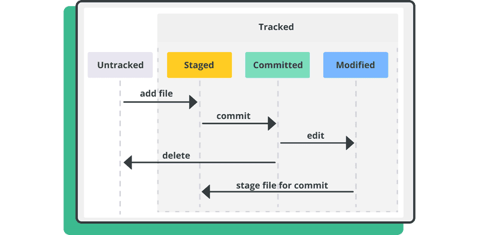

# Comandos

- Inicializar repositorio
```bash
git init
```

- Nos dice el estatus en el que se encuentra nuestro repo
```bash
git status
```

- Nos dice cuales son los últimos cambios que se han hecho
```bash
git log
```

## Estados de Git



- git add
```bash
git add comandos.md
```